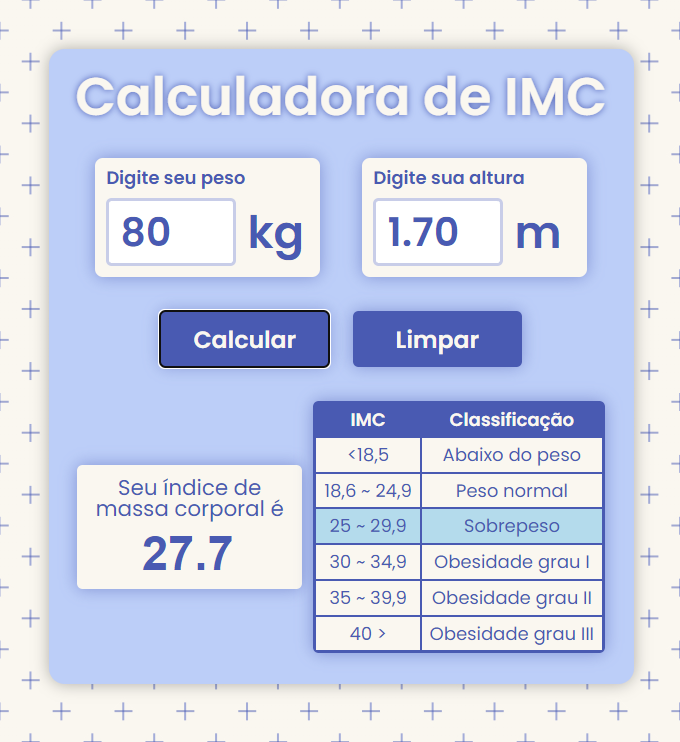

<h1 align="center">Calculadora de IMC</h1>

  

## 💻 Projeto

Esse é o primeiro projeto pessoal de uma série que pretendo fazer para montar meu portfólio. Fiz uma calculadora de IMC tentando criar algo bonito, além de funcional.
Essa calculadora usa a seguinte fórmula para o cálculo do índice de massa corporal: peso / altura * altura. Assim que o valor é calculado,  a tabela de classificação se torna visível, com a faixa do valor destacada em outra cor. Foram criadas versões mobile e web.

O projeto foi feito utilizando HTML, CSS e Javascript. Além disso, utilizei um plugin jQuery para a formatação das medidas e a plataforma MagicPattern para o background.

## 📚 Referências
- jQuery Mask Plugin - [AQUI](https://github.com/igorescobar/jQuery-Mask-Plugin)

- Magic Pattern - [AQUI](https://www.magicpattern.design/)

## 🔍 Preview
Clique [aqui](https://gusbuz.github.io/Calculadora-IMC/) para acessar o projeto.